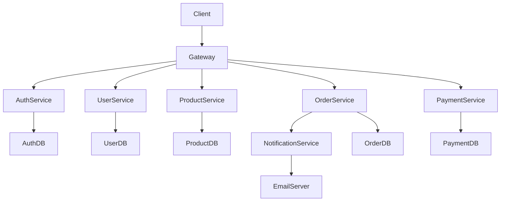
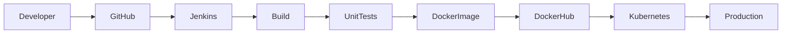
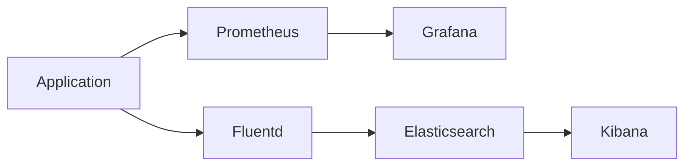

# Enterprise Microservices Documentation  
  
## Overview  
  
The **Enterprise Microservices Application** is a distributed system where multiple independent services work together to provide scalable, reliable, and maintainable business functionality.  
  
---  
  
## Table of Contents  
  
1. [Architecture Overview](#architecture-overview)  
2. [Architecture Diagram](#architecture-diagram)  
3. [Project Folder Structure](#project-folder-structure)  
4. [Service Descriptions](#service-descriptions)  
5. [Deployment Process](#deployment-process)  
6. [CI/CD Pipeline](#cicd-pipeline)  
7. [Environment Variables](#environment-variables)  
8. [Monitoring & Logging](#monitoring--logging)  
9. [Troubleshooting Guide](#troubleshooting-guide)  
  
---  
  
## Architecture Overview  
  
The application is composed of independent microservices that communicate through REST APIs and a Message Queue.  
  
### Components  
  
- API Gateway  
- Authentication Service  
- User Service  
- Product Service  
- Order Service  
- Payment Service  
- Notification Service  
- Database  
- Message Queue  
  
### Architecture Features  
  
- Independent Deployment  
- High Availability  
- Horizontal Scalability  
- Fault Isolation  
- Service Discovery  
  
---  
  
## Architecture Diagram  
  

  
---  
  
## Project Folder Structure  
  
```text  
enterprise-microservices/  
│  
├── api-gateway/  
│ ├── src/  
│ ├── config/  
│ └── Dockerfile  
│  
├── auth-service/  
│  
├── user-service/  
│  
├── product-service/  
│  
├── order-service/  
│  
├── payment-service/  
│  
├── notification-service/  
│  
├── docker/  
│  
├── kubernetes/  
│  
├── monitoring/  
│  
├── scripts/  
│  
├── docs/  
│  
├── .env  
│  
└── README.md  
```  
  
---  
  
## Service Descriptions  
  
| Service | Description | Database |  
|----------|-------------|-----------|  
| API Gateway | Handles incoming API requests | No |  
| Authentication Service | User login and JWT generation | Auth DB |  
| User Service | User profile management | User DB |  
| Product Service | Product management | Product DB |  
| Order Service | Order processing | Order DB |  
| Payment Service | Payment transactions | Payment DB |  
| Notification Service | Email and SMS notifications | No |  
  
### API Gateway  
  
Responsibilities  
  
- Request Routing  
- Authentication  
- Rate Limiting  
- Load Balancing  
  
---  
  
### Authentication Service  
  
Responsibilities  
  
- Register User  
- Login  
- Password Encryption  
- JWT Token Generation  
  
---  
  
### User Service  
  
Responsibilities  
  
- Create User  
- Update User  
- Delete User  
- Get User Details  
  
---  
  
### Product Service  
  
Responsibilities  
  
- Add Products  
- Update Products  
- Delete Products  
- Search Products  
  
---  
  
### Order Service  
  
Responsibilities  
  
- Create Orders  
- Update Orders  
- Cancel Orders  
  
---  
  
### Payment Service  
  
Responsibilities  
  
- Payment Processing  
- Refund Management  
- Transaction History  
  
---  
  
### Notification Service  
  
Responsibilities  
  
- Email Notification  
- SMS Notification  
- Push Notification  
  
---  
  
## Deployment Process  
  
### Step 1  
  
Clone Repository  
  
```bash  
git clone https://github.com/company/enterprise-microservices.git  
```  
  
### Step 2  
  
Move into the project directory  
  
```bash  
cd enterprise-microservices  
```  
  
### Step 3  
  
Build Docker Images  
  
```bash  
docker compose build  
```  
  
### Step 4  
  
Run the Containers  
  
```bash  
docker compose up -d  
```  
  
### Step 5  
  
Verify Running Containers  
  
```bash  
docker ps  
```  
  
### Step 6  
  
Deploy to Kubernetes  
  
```bash  
kubectl apply -f kubernetes/  
```  
  
---  
  
## CI/CD Pipeline  
  

  
### Pipeline Stages  
  
| Stage | Description |  
|--------|-------------|  
| Source | Pull source code |  
| Build | Compile application |  
| Test | Execute automated tests |  
| Docker | Build Docker image |  
| Deploy | Deploy to Kubernetes |  
| Monitor | Monitor application |  
  
---  
  
## Environment Variables  
  
| Variable | Description | Example |  
|----------|-------------|---------|  
| APP_PORT | Application Port | 8080 |  
| DB_HOST | Database Host | localhost |  
| DB_PORT | Database Port | 5432 |  
| DB_NAME | Database Name | enterprise_db |  
| DB_USER | Database Username | admin |  
| DB_PASSWORD | Database Password | password123 |  
| JWT_SECRET | JWT Secret Key | mysecret |  
| REDIS_HOST | Redis Host | localhost |  
| MQ_HOST | RabbitMQ Host | localhost |  
  
### Example .env  
  
```env  
APP_PORT=8080  
  
DB_HOST=localhost  
DB_PORT=5432  
DB_NAME=enterprise_db  
DB_USER=admin  
DB_PASSWORD=password123  
  
JWT_SECRET=mysecretkey  
  
REDIS_HOST=localhost  
  
MQ_HOST=localhost  
```  
  
---  
  
## Monitoring & Logging  
  
### Monitoring Tools  
  
| Tool | Purpose |  
|------|----------|  
| Prometheus | Metrics Collection |  
| Grafana | Dashboard Visualization |  
| Kubernetes Dashboard | Cluster Monitoring |  
  
### Logging Tools  
  
| Tool | Purpose |  
|------|----------|  
| Elasticsearch | Store Logs |  
| Fluentd | Collect Logs |  
| Kibana | Visualize Logs |  
  
### Monitoring Flow  
  

  
---  
  
## Troubleshooting Guide  
  
| Problem | Possible Cause | Solution |  
|----------|----------------|----------|  
| Service Not Starting | Port Already Used | Change Port |  
| Database Connection Failed | Database Offline | Start Database |  
| Authentication Failed | Invalid JWT | Generate New Token |  
| Docker Build Failed | Missing Dockerfile | Verify Dockerfile |  
| Kubernetes Pod Crash | Invalid Deployment | Check YAML Configuration |  
| High Memory Usage | Heavy Load | Scale Application |  
| Missing Logs | Logging Service Down | Restart Fluentd |  
  
### Useful Commands  
  
Check Docker Containers  
  
```bash  
docker ps  
```  
  
Check Kubernetes Pods  
  
```bash  
kubectl get pods  
```  
  
View Logs  
  
```bash  
docker logs <container-name>  
```  
  
Restart Deployment  
  
```bash  
kubectl rollout restart deployment user-service  
```  
  
Check Kubernetes Services  
  
```bash  
kubectl get services  
```  
  
---  
  
## Documentation Summary  
  
| Section | Completed |  
|----------|-----------|  
| Architecture Overview | ✅ |  
| Service Descriptions | ✅ |  
| Deployment Process | ✅ |  
| CI/CD Pipeline | ✅ |  
| Environment Variables | ✅ |  
| Monitoring & Logging | ✅ |  
| Troubleshooting Guide | ✅ |  
  
---  
  
## Markdown Concepts Used  
  
- Headings (`#`, `##`, `###`)  
- Table of Contents  
- Internal Links  
- Mermaid Diagrams  
- Tables  
- Folder Structures  
- Bash Code Blocks  
- Environment Variable Code Blocks  
- Advanced Code Blocks  
- Documentation Organization  
- Horizontal Rules  
- Lists
